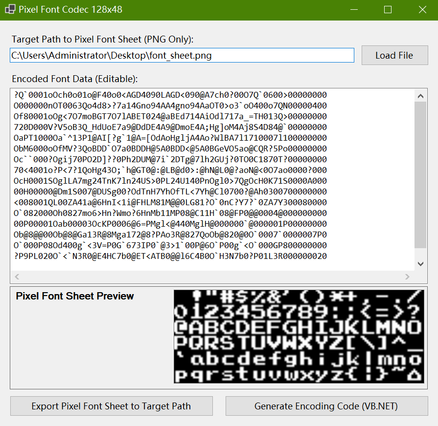

# Pixel Font Codec 128x48 (VB.NET WinForms)



## Description
This project is a pixel font codec designed to encode and decode 128x48 pixel fonts. Built with VB.NET WinForms, it offers real-time font sheet previews, one-click VB.NET code generation, and instant PNG export functionality, specifically tailored for use with [@DualBrain](https://github.com/DualBrain)'s [vbPixelGameEngine](https://github.com/DualBrain/vbPixelGameEngine) to simplify font loading and display in pixel art projects.

The codec draws inspiration from the source code of the above-mentioned game engine, which is my longstanding favorite for VB.NET game development. On studying its font handling implementation as is shown below, my idea emerged to create a dedicated codec built on similar principles, resulting in this project.

```vb
Dim data As String = ""
data &= "?Q`0001oOch0o01o@F40o0<AGD4090LAGD<090@A7ch0?00O7Q`0600>00000000"
data &= "O000000nOT0063Qo4d8>?7a14Gno94AA4gno94AaOT0>o3`oO400o7QN00000400"
data &= "Of80001oOg<7O7moBGT7O7lABET024@aBEd714AiOdl717a_=TH013Q>00000000"
data &= "720D000V?V5oB3Q_HdUoE7a9@DdDE4A9@DmoE4A;Hg]oM4Aj8S4D84@`00000000"
data &= "OaPT1000Oa`^13P1@AI[?g`1@A=[OdAoHgljA4Ao?WlBA7l1710007l100000000"
data &= "ObM6000oOfMV?3QoBDD`O7a0BDDH@5A0BDD<@5A0BGeVO5ao@CQR?5Po00000000"
data &= "Oc``000?Ogij70PO2D]??0Ph2DUM@7i`2DTg@7lh2GUj?0TO0C1870T?00000000"
data &= "70<4001o?P<7?1QoHg43O;`h@GT0@:@LB@d0>:@hN@L0@?aoN@<0O7ao0000?000"
data &= "OcH0001SOglLA7mg24TnK7ln24US>0PL24U140PnOgl0>7QgOcH0K71S0000A000"
data &= "00H00000@Dm1S007@DUSg00?OdTnH7YhOfTL<7Yh@Cl0700?@Ah0300700000000"
data &= "<008001QL00ZA41a@6HnI<1i@FHLM81M@@0LG81?O`0nC?Y7?`0ZA7Y300080000"
data &= "O`082000Oh0827mo6>Hn?Wmo?6HnMb11MP08@C11H`08@FP0@@0004@000000000"
data &= "00P00001Oab00003OcKP0006@6=PMgl<@440MglH@000000`@000001P00000000"
data &= "Ob@8@@00Ob@8@Ga13R@8Mga172@8?PAo3R@827QoOb@820@0O`0007`0000007P0"
data &= "O`000P08Od400g`<3V=P0G`673IP0`@3>1`00P@6O`P00g`<O`000GP800000000"
data &= "?P9PL020O`<`N3R0@E4HC7b0@ET<ATB0@@l6C4B0O`H3N7b0?P01L3R000000020"
```

Most importantly, this codec also supports a __drag-and-drop operation__ when loading a font sheet, so that users can easily import their font sheets without having to navigate to the file dialog.

## Prerequisites
- [.NET SDK](https://dotnet.microsoft.com/en-us/download/dotnet): version 8.0 or later
- IDE: Visual Studio 2022 or Visual Studio Code

## Installation and Usage
1. Clone the repository and navigate to the project directory:
```bash
git clone https://github.com/Pac-Dessert1436/Pixel-Font-Codec-128x48.git
cd Pixel-Font-Codec-128x48
```
2. Launch the project using `dotnet run` in VS Code, or via the "Run" button in Visual Studio 2022.
3. Once the application window opens, load a pixel font sheet by clicking "Load Font" and selecting a 128x48 pixel PNG file.
  - The PNG file must have a black background. The font color does not have to be white, but must not be close to black (i.e., darker than `Color.FromArgb(50, 50, 50)`).
  - The PNG file must contain a grid of 128 characters (8x8 pixels each) arranged in sequential order, from `Asc(32)` to `Asc(127)`.
  - If you are dragging a font sheet PNG file from your file explorer, simply drop the file onto the application window.
  - _Example of a valid pixel font sheet: _

4. After loading, preview the font in the designated area. Generate VB.NET encoding code with the "Generate Encoding Code (VB.NET)" button, and the corresponding VB.NET code will be automatically copied to your clipboard.

## How the Codec Works
The encoding process converts 128x48 pixel font sheets into compact string data that can be efficiently parsed by `vbPixelGameEngine`. Here's a detailed breakdown:

- The codec first processes the 128x48 pixel grid of the input PNG. It divides the sheet into individual character cells (8x8 pixels each) to isolate each glyph.
- For each cell, the codec converts pixel data into binary values: 1 for opaque pixels and 0 for background pixels. This creates a binary matrix for each character.
- The binary matrices are then converted into ASCII strings using a custom encoding scheme. This scheme maps 6-bit chunks of binary data to printable characters (similar to Base64 but optimized for font data), reducing file size while maintaining readability in VB.NET code.
- Individual character encodings are concatenated into a single string (as shown in the example code snippet) with delimiters that indicate character boundaries, enabling accurate reconstruction during decoding.
- When used with `vbPixelGameEngine`, the encoded string is parsed back into binary matrices. They are rendered as pixels on the screen, replicating the original font sheet appearance.

This approach ensures efficient storage and transmission of font data while maintaining pixel-perfect accuracy when rendered.

## License
This project is licensed under the MIT License. See the [LICENSE](LICENSE) file for details.